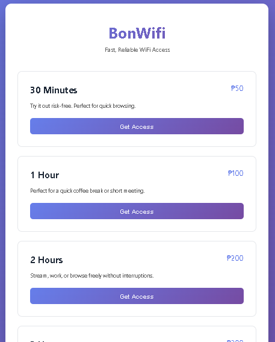
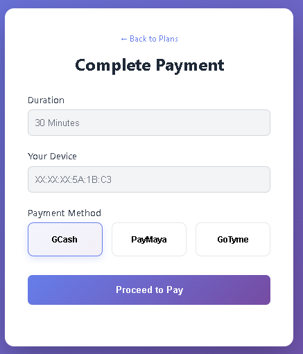
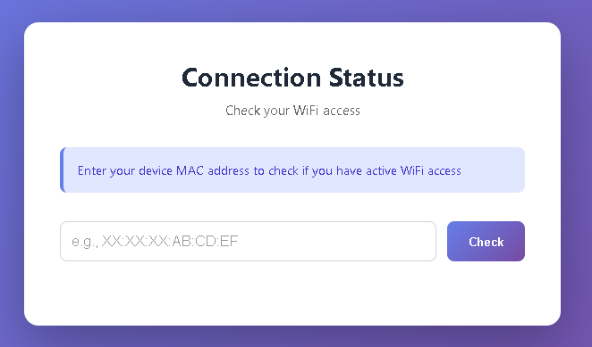
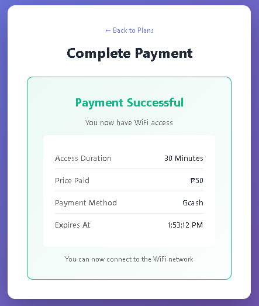

# 🌐 BonWifi

**Captive Portal WiFi Payment System** — Connect → Pay → Get Instant Access

Guests can buy WiFi access via QR codes (GCash, PayMaya, GoTyme). Auto-redeems and tracks sessions by MAC address.

---

## ⚡ Features

- 💳 **Multiple Payment Methods** — GCash, PayMaya, GoTyme (QR codes)
- 🎟️ **Instant Vouchers** — Auto-generated & auto-redeemed  
- 🔐 **Session Tracking** — MAC-based access with expiry times
- ✅ **Status Checker** — Guests verify access anytime
- 🚀 **Lightweight** — Runs on Raspberry Pi Zero 2 W (~$25)

---

## 🎨 Screenshots

### Landing Page
Select your plan: ₱50 (30m) | ₱100 (1h) | ₱200 (2h) | ₱300 (3h)


### Payment Page  
Choose payment method (GCash/PayMaya/GoTyme) → Scan QR → Instant access


### Status Page
Check your WiFi access by MAC address — see remaining time or buy now


### Success Screen
After payment confirmation


---

## 🚀 Quick Start

```bash
# Install
npm install

# Run
npm start

# Visit
http://localhost:3000           # Landing page
http://localhost:3000/pay       # Payment (auto with ?minutes=30)
http://localhost:3000/status    # Check access status
```

---

## 💻 Tech Stack

| Component | Tech |
|-----------|------|
| Frontend | HTML5, CSS3, JavaScript (QRious) |
| Backend | Node.js + Express |
| Database | SQLite |
| Network | hostapd (WiFi) + dnsmasq (DHCP/captive portal) |

---

## 📡 How It Works

```
Guest connects to WiFi
        ↓
Captive portal redirects to landing page
        ↓
Guest selects plan + payment method
        ↓
Scans QR code → Auto-confirm payment
        ↓
Voucher redeemed with device MAC
        ↓
WiFi access granted ✓
```

### API Reference

```bash
# Create voucher
POST /api/create-voucher
  body: { minutes, paymentMethod }
  returns: { code, minutes, paymentMethod }

# Redeem voucher for device
POST /api/redeem
  body: { mac, code }
  returns: { mac, expires_at }

# Check session status
GET /api/session/:mac
  returns: { active: bool, expires_at: ISO8601 }
```

---

## 🌐 Deployment on Raspberry Pi Zero 2 W

### Hardware

- Raspberry Pi Zero 2 W (~$15–30)
- microSD card (16GB+)
- 5V power supply (2.5A+)
- Optional: USB-Ethernet adapter, case

### Install

```bash
# 1. Flash Raspberry Pi OS Lite to microSD

# 2. Boot & enable SSH
ssh pi@raspberrypi.local
sudo raspi-config
# → Enable SSH

# 3. Clone & setup
git clone <repo-url>
cd BonWifi
chmod +x setup-pi-zero.sh
sudo ./setup-pi-zero.sh

# Done! WiFi broadcasts as "BonWifi" (password: BonWifi123!)
# Server runs at http://10.0.0.1:3000
```

### Manual Setup (if script doesn't work)

```bash
sudo apt update && sudo apt upgrade -y
sudo apt install -y hostapd dnsmasq sqlite3 nodejs npm

# Configure wlan0
sudo tee /etc/network/interfaces.d/wlan0 > /dev/null << EOF
auto wlan0
iface wlan0 inet static
  address 10.0.0.1
  netmask 255.255.255.0
EOF

# Configure dnsmasq
sudo tee /etc/dnsmasq.conf > /dev/null << EOF
interface=wlan0
dhcp-range=10.0.0.2,10.0.0.50,12h
dhcp-option=option:router,10.0.0.1
address=/#/10.0.0.1
EOF

# Configure hostapd
sudo tee /etc/hostapd/hostapd.conf > /dev/null << EOF
interface=wlan0
driver=nl80211
ssid=BonWifi
hw_mode=g
channel=7
wpa=2
wpa_passphrase=BonWifi123!
wpa_key_mgmt=WPA-PSK
wpa_pairwise=CCMP
EOF

# Enable IP forwarding
echo "net.ipv4.ip_forward=1" | sudo tee -a /etc/sysctl.conf
sudo sysctl -p

# NAT rules
UPSTREAM=$(ip route | grep default | awk '{print $5}' | head -1)
sudo iptables -t nat -A POSTROUTING -o $UPSTREAM -j MASQUERADE
sudo iptables-save | sudo tee /etc/iptables/rules.v4

# Install BonWifi
cd /opt
sudo git clone <repo-url> BonWifi
cd BonWifi
sudo npm install
sudo cp bonwifi.service /etc/systemd/system/
sudo systemctl enable bonwifi hostapd dnsmasq
sudo systemctl start bonwifi hostapd dnsmasq
```

### Verify

```bash
# Check services
sudo systemctl status bonwifi
sudo systemctl status hostapd

# Test: Connect to "BonWifi" network from another device
# Browser should auto-open http://10.0.0.1:3000/
```

---

## 🔧 Configuration

### Pricing

Edit `public/index.html` → change plan prices in the HTML or update `getPrice()` in `public/payment.html`

### WiFi SSID & Password

Edit `/etc/hostapd/hostapd.conf` on Pi:
```
ssid=YourNetworkName
wpa_passphrase=YourPassword
```

### Payment Methods

Currently mock (simulation). To integrate real payments:

1. **GCash** - Add credentials to `.env`, implement webhook verification in `server.js`
2. **PayMaya** - Similar process
3. **GoTyme** - Similar process

### Session Timeout

Edit `server.js` → `completePayment()` function → change `minutes * 60000`

---

## ⚠️ Production Checklist

- [ ] Replace payment simulator with real processor
- [ ] Add HTTPS (Let's Encrypt)
- [ ] Secure database with backups
- [ ] Add admin panel for refunds/vouchers
- [ ] Implement logging & monitoring
- [ ] Add rate limiting on payment endpoints
- [ ] Whitelist payment IPs (webhooks)
- [ ] Test with real devices
- [ ] Use PostgreSQL instead of SQLite for scale

---

## 📝 Notes

- **Payment**: Currently simulated — real processing requires payment provider integration
- **MAC Address**: Generated randomly in this demo — production gets it from router/device
- **Database**: SQLite is fine for testing; use PostgreSQL/MongoDB for production
- **No Auth**: Add authentication before going live

---

## 📞 Support

For issues:
1. Check logs: `sudo journalctl -u bonwifi -f`
2. Restart services: `sudo systemctl restart bonwifi hostapd dnsmasq`
3. Verify wlan0: `ifconfig wlan0`
4. Check DHCP: `cat /var/lib/dnsmasq/dnsmasq.leases`

---

## 📄 License

MIT — Free to use & modify
